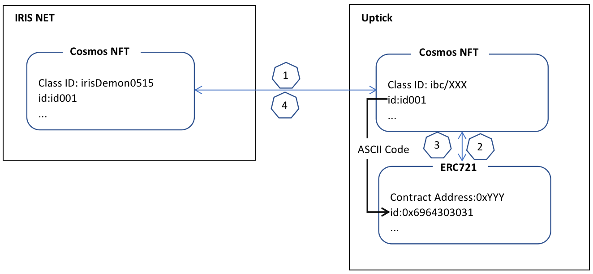

# gon-workshop

## Introduction

In this workshop we will be working with the [ISC721](https://github.com/cosmos/ibc/tree/main/spec/app/ics-721-nft-transfer) in order to transfer Non-Fungible Token between different testnets(IRISnet,Uptick) with nodejs SDK.

This repository contains all the instructions If you want to participate in gon hackathon. Please follow the step-by-step instructions below to complete the workshop.

This workshop's primary goal is to better understand the ISC721 nft transfer protocol and how packets are relayed from one chain to another using the IBC primitives.

### What does GoN Hackathon do

 

The Interchain Hackathon is the Phase 2 of GoN. It is designed to incentivize developers to build innovative solutions with Interchain NFTs (ICS721) with prizes equaling about $300,000 USD in Sponsors' tokens and credits.

+ Interchain NFT Flow 

  

### Step-by-step Instructions

Please follow these instructions to complete the workshop:

0. [GoN Hackathon Preparation](./docs/1.Preparation.md)
1. [Transfer NFT From Irisnet to Uptick](./docs/2.Iris2Uptick.md)
2. [Convert From Cosmos NFT to ERC721](./docs/3.CosmosNFT2ERC.md)
3. [Convert From ERC721 to Cosmos NFT](./docs/4.ERC2CosmosNFT.md)
4. [Transfer NFT From Uptick to Irisnet](./docs/5.Uptick2Iris.md)

### References
+ [Game of NFTS Hackathon Workshop](https://github.com/xavier200203/gon2-workshop/)
+ [Game of NFTS Hackathon](https://dorahacks.io/hackathon/game-of-nfts)
+ [Interchain NFTS - Cosmos Ecosystem Live Chat](https://www.youtube.com/watch?v=1Yl7EgnBLms)
+ [Game of NFTS](https://interchainnfts.dev/gon)
+ [Cosmos Network Discord](https://discord.com/invite/cosmosnetwork)
+ [Game of NFTS WorkShop](https://github.com/xavier200203/gon-workshop)