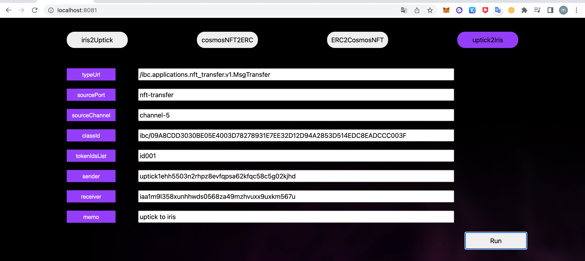
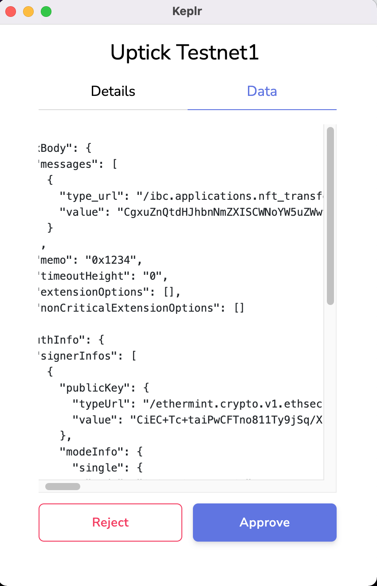

# 5.Cross Chain from Uptick to Irisnet

## Overview

This part mainly introduce the cross-chain from Uptick to Irisnet.

### Irisnet to Uptick
#### 1.Parameter Settings


#### 2. Run the Command


#### 3. Get the Result

```sh
#uptick query result
uptickd query collection owner uptick1ehh5503n2rhpz8evfqpsa62kfqc58c5g02kjhd
```
